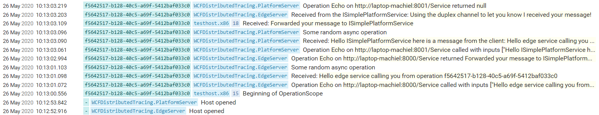
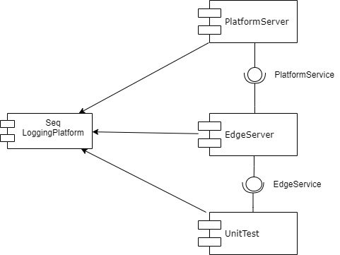

# WCFDistributedTracing

This project shows how distributed tracing in WCF can be used to do structured logging.
DistributedOperationContext is used to pass context information through the distributed execution path.
Serilog is used as the logging framework, with an output to Seq for central analysis.

This will result in the following output in Seq:


## Details

### Application structure


### Initiate new trace
When there is not a current DistributedOperationContext a new one will be created with a new TraceId.
It is also possible to force a new DistributedOperationContext when it is necessary to run multiple parralel WCF calls in the same thread using FlowingOperationContextScope:
```csharp
var channelFactory = new ChannelFactory<ISimpleEdgeService>(new BasicHttpBinding(), new EndpointAddress(SimpleEdgeService.BaseAddress));
channelFactory.Endpoint.AddTracingBehavior();
var proxy = channelFactory.CreateChannel();

using (var scope = new FlowingOperationContextScope(proxy as IContextChannel))
{
    var traceId = DistributedOperationContext.Current?.TraceId;

    // Every async operation should be continued on the FlowingOperationContextScope
    await Task.Delay(200).ContinueOnScope(scope);

    var result = await proxy.Echo($"Hello edge service calling you from operation {traceId}").ContinueOnScope(scope);
    Log.Information("Received: {Answer}", result);
}
```

### Async pattern
Since .Net 4.6.2 the OperationContext is maintained in Async scenarios. However this is disabled by default for backwards compatibility reasons. To disable disabling this feature add the following to the appSettings:
```
<add key="wcf:disableOperationContextAsyncFlow" value="false" />
```

At the beginning of a trace a new OperationContext is created using an OperationContextScope. The default OperationContextScope cannot handle the async scenario in its Dispose logic. Therefore we included the implementation of [FlowingOperationContextScope]( https://stackoverflow.com/questions/18284998/pattern-for-calling-wcf-service-using-async-await/22753055#22753055) created by [noseratio](https://stackoverflow.com/users/1768303/noseratio)

### Duplex channel
Duplex channels are supported. The interaction between the EdgeServer and the PlatformServer shows this.

## ToDo:
* 
