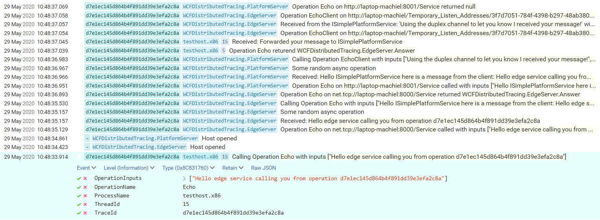

# WCFDistributedTracing


This project shows how distributed tracing in WCF can be used to do structured logging.
DistributedOperationContext is used to pass context information through the distributed execution path.
Serilog is used as the logging framework, with an output to Seq for central analysis.

This will result in the following output in Seq:


## Details

### Application structure


### Initiate new trace
When there is not a current DistributedOperationContext during a WCF call a new one will be created with a new TraceId.
It is also possible to force a new DistributedOperationContext when it is necessary to run multiple parralel WCF calls with the same TraceId:
```csharp
var channelFactory = new ChannelFactory<ISimpleEdgeService>(new BasicHttpBinding(), new EndpointAddress(SimpleEdgeService.BaseAddress));
channelFactory.Endpoint.AddTracingBehavior();
var proxy = channelFactory.CreateChannel();

// All WCF operations and logging statements will have the same TraceId after this initialization
DistributedOperationContext.Current = new DistributedOperationContext();

var result = await proxy.Echo($"Hello edge service calling you from operation {traceId}").ContinueOnScope(scope);
Log.Information("Received: {Answer}", result);
```

### Async pattern
The DistributedOperationContext is scoped using AsyncLocal. That means it flows with async operations downstream, but not upstream if changed downstream.

### Duplex channel
Duplex channels are supported. The interaction between the EdgeServer and the PlatformServer shows this.

## ToDo:
* Log WCF call including parameters
* Let the unit test automatically test the distributed output somehow
* Make it a NuGet library
